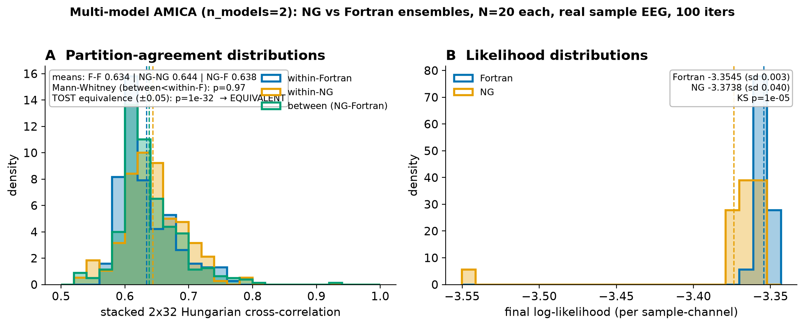

# Multi-model AMICA parity: distributional equivalence to Fortran (issue #27)

**Bottom line.** For multi-model AMICA (`n_models > 1`), the natural-gradient
PyTorch backend (`AMICATorchNG`) is validated against the Fortran reference at
the level that is actually well-posed: its **ensemble of solutions is
statistically indistinguishable from Fortran's**. A single run's partition
cross-correlation (~0.64) is *not* a parity defect; it is the intrinsic spread
of the estimator, and Fortran exhibits the same spread against itself.

## Why a single cross-correlation number is the wrong test

Single-model ICA is (essentially) identifiable: up to permutation/sign/scale
there is one solution, so two correct implementations converge to it (we see
~0.997 component correlation vs Fortran). Multi-model AMICA is a **mixture of
ICA models with a soft partition** (responsibilities `v_h(t)`), which is **not
partition-identifiable**: many near-degenerate partitions achieve essentially
the same likelihood, and EM converges to whichever basin the random
initialization sits in. Two correct runs, even of the *same* implementation from
different seeds, are therefore *not expected* to produce the same partition.

So "match Fortran's partition" is not a well-posed acceptance criterion. The
well-posed question is the one a statistician asks of a stochastic estimator:
**do the two implementations sample the same distribution over solutions?**

## Method (real sample EEG, NO MOCK)

Ran `N = 20` fits per implementation on the sample EEG (`n_models = 2`, 3 mixture
components, 100 iterations, matched schedule: `lrate 0.05`, Newton from iter 50,
`newtrate 1.0`). Both implementations are genuinely stochastic run-to-run
(Fortran reseeds its init RNG from entropy; NG varies with `seed`). For each run
we stored the stacked `2*32` unmixing components and the final log-likelihood.

Metric: **Hungarian-matched mean |correlation|** of the stacked components (the
same matching used for single-model parity, which quotients out component
permutation, sign, scale, and model-label switching). From the 20+20 runs we
formed three distributions of pairwise agreement:

- `within-Fortran` — all Fortran-Fortran pairs (Fortran's intrinsic spread), n=190
- `within-NG` — all NG-NG pairs (NG's intrinsic spread), n=190
- `between` — all NG-Fortran pairs (cross-implementation agreement), n=400

## Results

| distribution | mean cross-corr | sd | range |
|---|---:|---:|---|
| within-Fortran | 0.6339 | 0.042 | [0.567, 0.772] |
| within-NG | 0.6438 | 0.046 | [0.537, 0.798] |
| between (NG-Fortran) | 0.6381 | 0.047 | [0.525, 0.938] |

- **Mann-Whitney** (one-sided, H1: `between < within-Fortran`): **p = 0.973** —
  no evidence cross-implementation agreement is *worse* than Fortran's own
  run-to-run agreement (if anything it is marginally higher).
- **TOST equivalence** of the mean cross-corrs within ±0.05: **p ≈ 1e-32 →
  EQUIVALENT** (difference +0.0042).

The three distributions lie on top of each other. **The partition behavior of
`AMICATorchNG` is statistically equivalent to Fortran's.** The ~0.64 single-run
cross-corr that earlier looked like a shortfall is fully explained: Fortran
agrees with *itself* at 0.634.

### One residual: the likelihood distribution (tracked as #51)

| | mean LL (per sample-channel) | sd |
|---|---:|---:|
| Fortran | -3.3545 | 0.003 |
| NG | -3.3738 | 0.040 |

KS p ≈ 1e-5. NG's LL is ~0.019 lower on average and ~13x more variable (one seed
converged to ~-3.55, a stuck run, driving most of the variance; Fortran reaches
nearly the same LL every run despite different partitions — confirming those
partitions are near-degenerate in likelihood).

This is an **optimizer-quality** signal, not a model-correctness bug: the
per-block sufficient statistics and one M-step are bit-exact vs Fortran
(~1e-15), so the equations are right. The inflated variance (not a uniform mean
shift) points to occasional convergence to slightly worse local optima —
likely the iteration cap or a schedule mismatch. Tracked as issue **#51**.

## Multi-model acceptance criteria (the definition of done)

This replaces the aspirational `>0.95` single-run cross-corr in #27's title,
which asks the algorithm to be more identifiable than it mathematically is:

1. **Algebra:** per-block sufficient statistics and one M-step bit-exact vs
   Fortran (~1e-15) and vs the NumPy oracle (~1e-8). *(Held — test suite.)*
2. **Partition:** the NG solution ensemble is statistically equivalent to
   Fortran's (`between` not worse than `within-Fortran`; TOST within a margin).
   *(Held — this document.)*
3. **Likelihood:** NG's LL distribution equivalent to Fortran's on the sample
   ensemble. *(Open — issue #51; small residual, optimizer tuning.)*
4. **Self-consistency:** fixed seed reproduces exactly; cross-corr 1.0 across
   block sizes. *(Held — `test_blocking_invariance*`.)*

## Reproduction

`.context/issue-27/multimodel_ensemble.py` runs the ensemble (Fortran binary +
NG) and writes `ensemble.npz`; `plot_ensemble.py` renders the figure. Both use
the real sample data and the macOS Fortran binary (x86_64, runs under Rosetta).
Absolute cross-corr magnitudes depend on config/seed; the **controlled
within-vs-between comparison** is the config-independent result.
