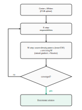
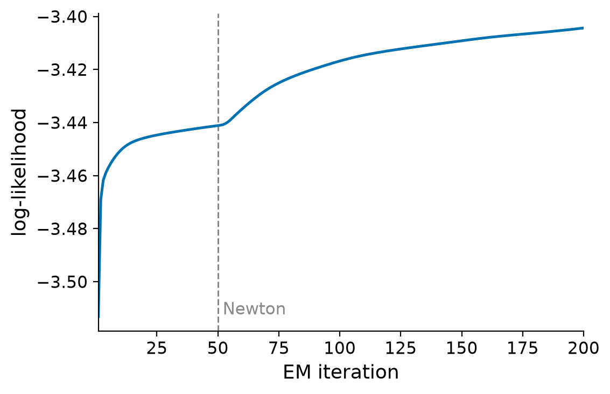

# How AMICA works

AMICA fits its [generative model](what-is-amica.md) by **maximum likelihood**:
it searches for the unmixing matrices, biases, model weights, and source-density
parameters that make the observed data most probable.

## The objective

Given $N$ samples $\mathbf{x}(t)$, AMICA maximizes the total log-likelihood

$$
\mathcal{L} = \sum_{t=1}^{N} \log
\sum_{h=1}^{H} \gamma_h\,|\det \mathbf{W}_h|
\prod_{i=1}^{n} p_{hi}\!\big(y_{hi}(t)\big),
\qquad
y_{hi}(t) = \mathbf{w}_{hi}^{\top}\big(\mathbf{x}(t)-\mathbf{c}_h\big),
$$

over all parameters $\{\mathbf{W}_h, \mathbf{c}_h, \gamma_h,
\alpha_{hij}, \mu_{hij}, \beta_{hij}, \rho_{hij}\}$. The $|\det\mathbf{W}_h|$
term is what keeps the unmixing matrices from collapsing to zero.

## The algorithm

Because the model has hidden assignments (which model, and which mixture
component, generated each sample), it is fit with
**expectation-maximization (EM)**, wrapped in a preprocessing and update loop.

{ width=760 }
/// caption
The AMICA fitting loop: preprocessing, then alternating E- and M-steps until the
log-likelihood converges.
///

### Preprocessing

The data are centered (mean removed) and **whitened** with a symmetric (ZCA)
sphering matrix, matching the Fortran reference. Whitening removes second-order
correlations so the iterations only have to resolve higher-order structure.

### E-step (responsibilities)

Holding the parameters fixed, AMICA computes the posterior probabilities of the
hidden assignments for each sample: the probability that model $h$ generated it,
and, within each source, the probability that mixture component $j$ produced the
activation. These *responsibilities* are the expected sufficient statistics used
by the M-step.

### M-step (parameter updates)

Holding the responsibilities fixed, AMICA updates the parameters:

- **Source-density parameters** ($\alpha, \mu, \beta, \rho$) are updated with the
  exact expectation-maximization closed-form expressions (a digamma equation for
  the shape $\rho$).
- **Unmixing matrices** are updated with the **natural gradient**, which
  accounts for the geometry of the space of matrices and converges far faster
  than the ordinary gradient:

$$
\Delta \mathbf{W}_h \;\propto\;
\big(\mathbf{I} - \langle\, \mathbf{g}(\mathbf{y})\,\mathbf{y}^{\top}\rangle\big)\,
\mathbf{W}_h,
$$

  where $\langle\cdot\rangle$ is the responsibility-weighted average over samples
  and $\mathbf{g}$ is the **score function** of the source density,
  $g_i(y) = -\,\partial \log p_i(y)/\partial y$. For a single generalized
  Gaussian component this is $g(y) = \rho\,\beta^{\rho}\,|y|^{\rho-1}\,\mathrm{sign}(y)$;
  for a mixture it is the responsibility-weighted combination of its components'
  scores. At the optimum the bracket vanishes, i.e. the sources are decorrelated
  from their own scores, a statement of independence.

- **Newton update.** Once the iterates are close, AMICA switches the unmixing
  update to a **Newton step** (using the per-source curvature of the
  likelihood), which sharpens convergence near the optimum. pyAMICA keeps this
  step positive-definite for stability.

### Convergence and the returned solution

Each EM iteration increases the log-likelihood until it converges. Because the
learning-rate schedule is not strictly monotone, pyAMICA returns the
**highest-likelihood iterate** it visited (the *best-iterate* safeguard) rather
than the last one, and reports its likelihood as `final_ll_`.

{ width=640 }
/// caption
Log-likelihood versus iteration on the bundled sample EEG: the objective rises
and converges toward the reference solution.
///

## Relationship to the Fortran reference

Every M-step update in pyAMICA is derived to match the AMICA reference Fortran
implementation, and on real sample EEG the natural-gradient backend reaches the
same solution (log-likelihood and Hungarian-matched component correlation). See
[Validation & Parity](../guides/validation.md) for the acceptance criteria and
how cross-backend equivalence depends on data adequacy.
