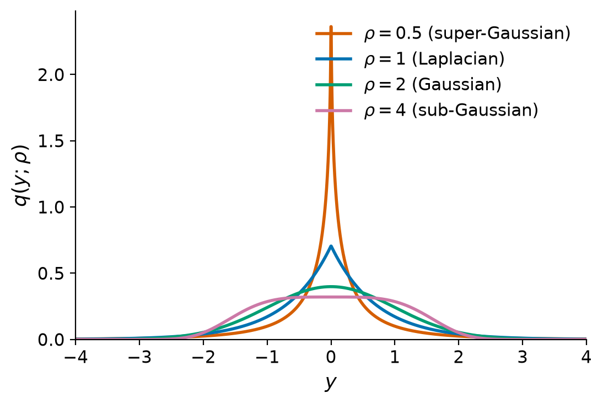
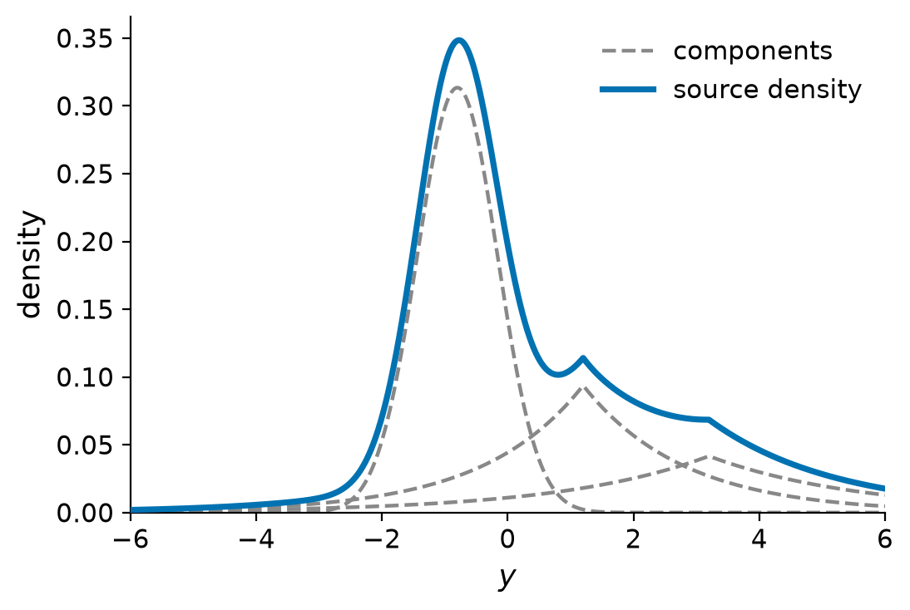

# What is AMICA?

Classical ICA algorithms assume a single, *fixed* shape for every source density
(for example a logistic or Laplacian distribution). Real signals rarely oblige:
some EEG sources are sharply peaked and heavy-tailed (super-Gaussian), others are
flatter (sub-Gaussian), and the mixing regime itself can change over time.
Assuming the wrong density biases the separation.

**AMICA (Adaptive Mixture ICA)** removes that limitation with two "adaptive
mixture" ideas layered on top of ICA.

## Idea 1: adaptive source densities

Instead of fixing the source distribution, AMICA models each source as a
**mixture of generalized Gaussians** and learns its shape from the data.

The generalized Gaussian density with location $\mu$, scale $\beta$, and shape
$\rho$ is

$$
q(y;\rho,\mu,\beta) =
\frac{\rho\,\beta}{2\,\Gamma(1/\rho)}\,
\exp\!\big(-\beta^{\rho}\,|y-\mu|^{\rho}\big).
$$

The shape parameter $\rho$ controls the tails:

- $\rho = 2$ recovers the **Gaussian**,
- $\rho = 1$ is the **Laplacian** (peaky, super-Gaussian),
- $\rho < 2$ is **super-Gaussian** (heavier-tailed, more kurtotic),
- $\rho > 2$ is **sub-Gaussian** (flatter, platykurtic).

{ width=640 }
/// caption
The generalized Gaussian family spans super-Gaussian ($\rho<2$), Gaussian
($\rho=2$), and sub-Gaussian ($\rho>2$) shapes with a single parameter.
///

Each source density is a weighted mixture of $m$ such components, so it can take
on skewed and multimodal shapes:

$$
p_i(y) = \sum_{j=1}^{m} \alpha_{ij}\,
q\!\big(y;\rho_{ij},\mu_{ij},\beta_{ij}\big),
\qquad \sum_{j=1}^{m}\alpha_{ij}=1 .
$$

{ width=640 }
/// caption
An adaptive source density (solid) as a weighted sum of generalized Gaussian
mixture components (dashed).
///

pyAMICA supports all five source-density families of the reference
implementation (generalized Gaussian is the default), plus an extended-Infomax
switcher that flips each source between super- and sub-Gaussian by the sign of
its kurtosis.

## Idea 2: multiple ICA models

A single unmixing matrix assumes one fixed mixing regime for the whole
recording. AMICA instead fits a **mixture of $H$ ICA models**, each with its own
unmixing matrix $\mathbf{W}_h$, bias $\mathbf{c}_h$, and source densities. A
per-sample *responsibility* softly assigns each time point to the model that
explains it best, so AMICA can capture non-stationarity and distinct regimes in
the data.

The full generative model gives each observation the mixture likelihood

$$
p(\mathbf{x}) = \sum_{h=1}^{H} \gamma_h\,
|\det \mathbf{W}_h|
\prod_{i=1}^{n} p_{hi}\!\big(\mathbf{w}_{hi}^{\top}(\mathbf{x}-\mathbf{c}_h)\big),
$$

where $\gamma_h$ are the model weights ($\sum_h \gamma_h = 1$),
$\mathbf{w}_{hi}^{\top}$ is the $i$-th row of $\mathbf{W}_h$, and the
$|\det \mathbf{W}_h|$ (Jacobian) term accounts for the change of variables from
$\mathbf{x}$ to the sources.

With $H = 1$ this reduces to ordinary ICA with adaptive source densities; that
single-model case is the default and reaches bit-level parity with the Fortran
reference.

AMICA also supports **shared components** across models (merging near-collinear
sources) and **outlier rejection**. These are off by default.

Next: [How AMICA works](how-amica-works.md), which fits this model by maximizing
its likelihood.
