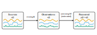
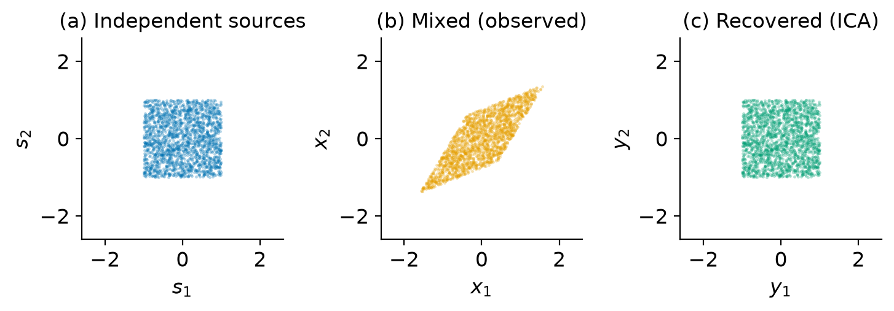

# What is ICA?

## The cocktail-party problem

Imagine several people talking at once in a room, recorded by several
microphones. Each microphone picks up a different *mixture* of all the voices.
**Independent Component Analysis (ICA)** is the art of recovering the individual
voices from the mixtures alone, without knowing who is speaking, where they
stand, or how the room blends the sound. This is *blind source separation*:
"blind" because we know neither the sources nor how they were mixed.

The same problem appears in electroencephalography (EEG). Each scalp electrode
records a mixture of many overlapping brain and non-brain sources (cortical
patches, eye blinks, muscle activity). ICA unmixes the electrode signals into
maximally independent components, which often correspond to physiologically
meaningful sources.

{ width=680 }
/// caption
ICA recovers unknown independent sources from their observed linear mixtures by
estimating an unmixing matrix.
///

## The linear mixing model

ICA assumes the observations are an instantaneous linear mixture of the sources.
With $n$ sources and $n$ sensors, at each time point $t$:

$$
\mathbf{x}(t) = \mathbf{A}\,\mathbf{s}(t)
$$

where

- $\mathbf{s}(t) \in \mathbb{R}^{n}$ are the unknown, mutually independent source
  activations,
- $\mathbf{A} \in \mathbb{R}^{n \times n}$ is the unknown **mixing matrix**
  (its columns are the sensor patterns, or "scalp maps," of each source),
- $\mathbf{x}(t) \in \mathbb{R}^{n}$ are the observed sensor signals.

The goal is to estimate an **unmixing matrix** $\mathbf{W}$ that inverts the
mixing, so the recovered sources

$$
\mathbf{y}(t) = \mathbf{W}\,\mathbf{x}(t) \approx \mathbf{s}(t),
\qquad \mathbf{W} \approx \mathbf{A}^{-1},
$$

are as close to the true sources as the data allow.

## Why it works: independence and non-Gaussianity

Two assumptions make this well-posed:

1. **Statistical independence.** The sources are assumed mutually independent, so
   their joint density factorizes, $p(\mathbf{s}) = \prod_i p_i(s_i)$. ICA looks
   for the $\mathbf{W}$ that makes the outputs $y_i$ as independent as possible.
2. **Non-Gaussianity.** By the central limit theorem, a sum of independent
   variables is "more Gaussian" than its parts, so a mixture looks more Gaussian
   than the underlying sources. Recovering the sources is therefore equivalent to
   finding the projections that are *maximally non-Gaussian*. A crucial
   corollary: **Gaussian sources cannot be separated** (a rotation of
   independent Gaussians is still independent Gaussians), so ICA requires at most
   one Gaussian source.

The geometry is easy to see with two sources. Independent sources fill an
axis-aligned region; mixing shears and rotates that region; ICA finds the
transform that restores the independent axes.

{ width=720 }
/// caption
Left: two independent sources. Middle: the observed mixture is sheared and
rotated. Right: ICA recovers the independent axes (up to order and scale).
///

## Preprocessing: centering and whitening

In practice the data are first **centered** (mean removed) and **whitened**
(also called *sphering*): linearly transformed so the channels are uncorrelated
and have unit variance. Whitening removes all second-order structure, reducing
the remaining ICA problem to finding an orthogonal rotation, which is both
faster and better conditioned. pamica uses a symmetric (ZCA) whitening that
matches the Fortran reference.

## What ICA cannot pin down

Because $\mathbf{A}$ and $\mathbf{s}$ are both unknown, two ambiguities are
irreducible:

- **Permutation.** The sources can be recovered in any order.
- **Scale and sign.** Each source's amplitude (and sign) is arbitrary, since a
  scalar can move between a column of $\mathbf{A}$ and the corresponding source.

These do not affect the usefulness of the components; they only mean component
*indices* and *scaling* are conventions, not ground truth. pamica follows the
EEGLAB conventions for ordering and sign where it matters (see
[Validation & Parity](../guides/validation.md)).

Next: [What is AMICA?](what-is-amica.md), which relaxes the fixed-source-density
assumption and adds multiple models.
