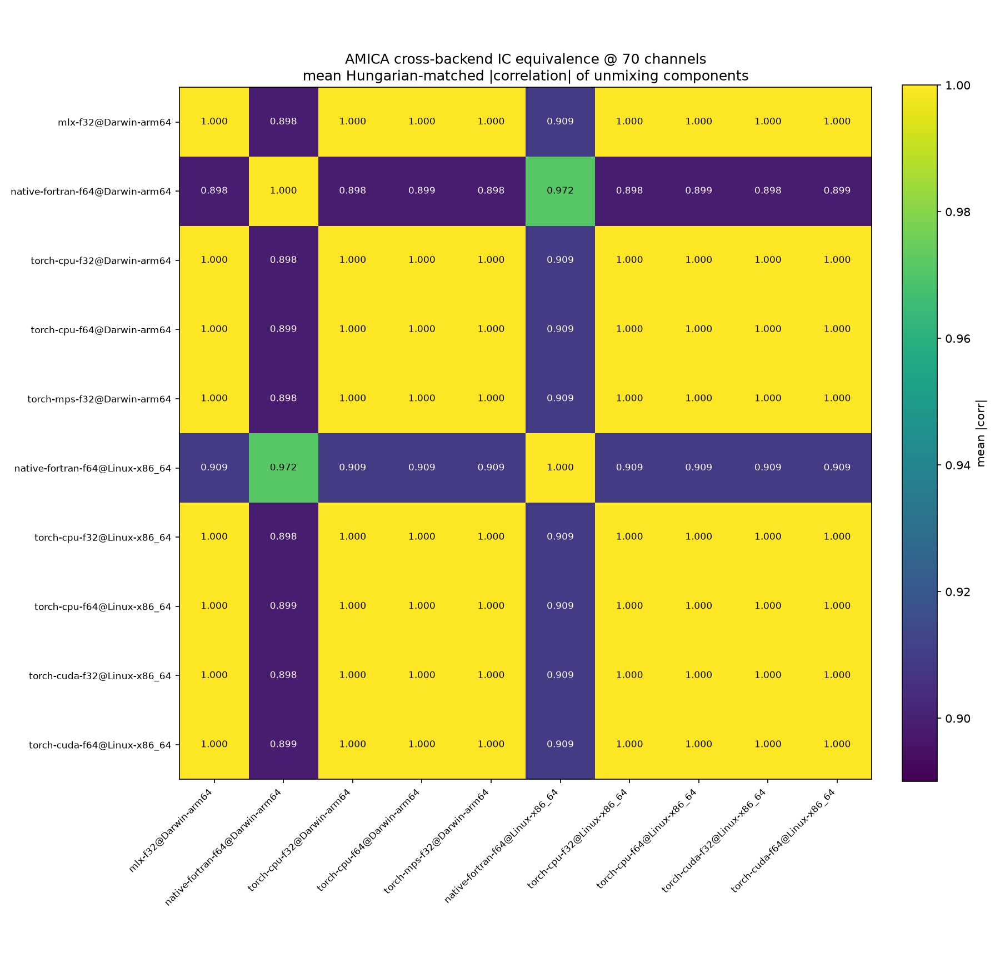
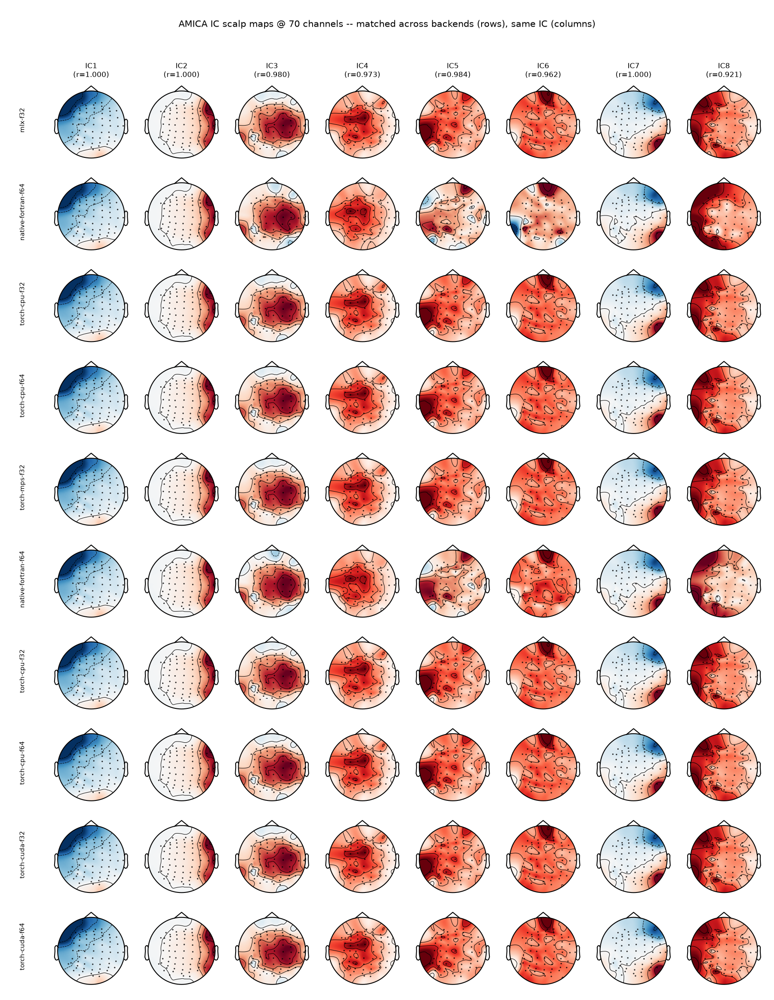
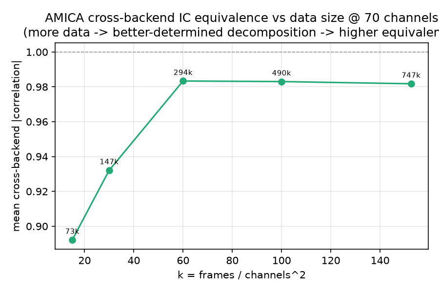

# Validation & Parity

**Correctness in pyAMICA is defined as parity with the reference Fortran binary,
not merely as convergence.** A run is correct when it reproduces the Fortran output within numerical tolerance.
This page collects the full verification evidence: bit-exact score functions, single-model parity,
multi-model distributional equivalence, cross-platform device and precision invariance,
the EEGLAB drop-in round-trip, and the remaining validated behaviors.
Every result uses the bundled real sample EEG and the reference Fortran binary; none uses synthetic data.
This is currently an exemplar validation on one real recording (the EEGLAB tutorial dataset:
32 channels, 30504 samples at 128 Hz, ~238 s) plus one external benchmark subject
(OpenNeuro ds002718 sub-002); extending to a multi-subject, multi-dataset validation is planned
future work, not yet done.
Throughout, IC abbreviates independent component and LL log-likelihood.

## Validation at a glance

| What was checked | How | Result |
|---|---|---|
| Source-density score and log-density (non-GG families) | vs the literal `amica15.f90` expressions | bit-exact ($<10^{-12}$) |
| Per-block sufficient statistics and one M-step | vs Fortran | bit-exact ($\sim\!10^{-15}$) |
| Single-model solution | log-likelihood, component correlation, Amari distance vs Fortran | LL within ~0.005 of $-3.4018$; correlation 0.997; Amari 0.006 |
| Multi-model solution | distributional equivalence over 20-run ensembles | indistinguishable from Fortran's own run-to-run spread ($p = 0.96$) |
| Device and precision invariance | same independent components across CPU/CUDA/MPS/MLX, float32/float64, Linux/macOS | identical (1.000) across all eight torch/MLX combinations |
| Cross-backend log-likelihood | converged LL across every backend | agree to ~3 significant digits (max pairwise ~0.003) |
| EEGLAB output | `write_amica_output` round-trip through `loadmodout15` | single-model bytes are an exact serialization; loads with correct layout |
| Degenerate fits | NaN or singular log-likelihood | refused, never returned as NaN sources |

## The validation harness

`validate_implementations.py` runs the implementations on real sample EEG,
matches components across implementations with the Hungarian algorithm,
and reports log-likelihood and per-component correlation. It always uses real sample data and the Fortran binary, never synthetic data.
Conformity with Fortran is measured with two metrics used throughout this page: Hungarian-matched component correlation,
and the Amari distance (`amari_distance` in `validate_implementations.py`),
a standard unmixing-matrix comparison metric (Amari, Cichocki & Yang, 1996) that is permutation- and scale-invariant by construction and so needs no assignment step.

## Single-model parity

On real sample EEG the natural-gradient backend reaches Fortran's solution:

- Log-likelihood ~ -3.40 (Fortran ~ -3.4018).
- Hungarian-matched component correlation ~0.997, clearing the >0.95 gate.
- Amari distance ~0.006.

The fixed source-density families are bit-exact against the literal Fortran score/derivative expressions (~1e-15),
and the backend converges to the binary's solution within ~0.005 log-likelihood.

### Source-density families are bit-exact

AMICA models each source with one of the reference's five `pdftype` density families.
For every family other than the default generalized Gaussian, the vectorized log-density and score reproduce the literal `amica15.f90` expressions
to float64 precision (test bound $<10^{-12}$, observed $\sim\!10^{-15}$):
the source model is not an approximation of the Fortran one, it is the same function.
The generalized Gaussian has no closed-form literal to compare against, since its score depends on the adaptive shape $\rho$,
so the default family is validated by the single-model parity above instead.
The oracle column below records which check applies to each family:

| `pdftype` | Density family | Score $f_p(y)$ | Bit-exact oracle |
|---|---|---|---|
| 0 (default) | Generalized Gaussian (adaptive shape $\rho$) | GG score (shape-dependent) | single-model parity above |
| 1 | Extended-Infomax adaptive switch (super- ↔ sub-Gaussian by kurtosis sign) | $y + \tanh y$ / $y - \tanh y$ | real-data LL (see below) |
| 2 | Gaussian | $y$ | yes |
| 3 | Logistic | $\tanh(y/2)$ | yes |
| 4 | Sub-Gaussian (cosh$^{+}$) | $y - \tanh y$ | yes |

`pdftype=0` is the default and is byte-for-byte the pre-family implementation.
The `pdftype=1` extended-Infomax switcher flips each source between the super-Gaussian (code 1) and
sub-Gaussian (code 4) densities on a kurtosis schedule; its dynamic switch has no bit-exact oracle
(the reference's `do_choose_pdfs` accumulator is dead code in the binary), so it is validated by real-data
log-likelihood instead. Each fixed family converges within ~0.005 LL of the binary at a matched Newton budget.
See `pyAMICA/tests/torch_tests/test_ng_pdf_families.py` and ADR 0002.

## Multi-model equivalence

Multi-model AMICA is not partition-identifiable, so exact partition parity with Fortran is the wrong acceptance bar.
The right test is whether the two implementations sample the same distribution over solutions. Running an ensemble of `N = 20` fits per implementation on the real sample EEG (`n_models = 2`, 3 mixture components, 100 iterations, matched schedule),
the pyAMICA-vs-Fortran partition cross-correlation distribution overlaps Fortran's own run-to-run distribution:

| Distribution (pairwise Hungarian-matched \|corr\|) | Mean | SD | Range |
|---|---:|---:|---|
| within-Fortran (Fortran vs Fortran) | 0.638 | 0.040 | [0.572, 0.797] |
| within-pyAMICA (pyAMICA vs pyAMICA) | 0.661 | 0.045 | [0.583, 0.820] |
| between (pyAMICA vs Fortran) | 0.649 | 0.045 | [0.582, 0.886] |

{ width=640 }
/// caption
Pairwise Hungarian-matched component correlation for 20 pyAMICA and 20 Fortran multi-model fits of the sample EEG.
The within-Fortran, within-pyAMICA, and between-implementation distributions overlap: the estimators sample the same solution space.
///

The three distribution means lie within 0.011 of each other (between 0.649, within-Fortran 0.638), well inside a $\pm 0.05$ margin. To test this at the correct unit of analysis, we use a **run-level permutation test**:
the 190/400 pairwise correlations are *not* independent (each of the 40 runs appears in ~39 pairs),
so a Mann-Whitney or TOST applied to the pairwise values is pseudoreplicated and its p-value is invalid.
Permuting the 40 runs as intact units instead (20000 permutations, statistic = within-Fortran minus between-implementation mean correlation) respects that dependence and finds **no evidence that cross-implementation agreement is worse than Fortran's own run-to-run agreement ($p = 0.96$)**.

The single-run cross-correlation of ~0.65 is therefore intrinsic estimator spread, not a shortfall: Fortran agrees with *itself* at 0.64.
The per-block sufficient statistics and one M-step are bit-exact against Fortran (~$10^{-15}$),
so the update equations are correct;
a small residual in the log-likelihood *distribution* (pyAMICA $-3.363 \pm 0.006$ vs Fortran $-3.354 \pm 0.003$;
Kolmogorov-Smirnov $p \approx 6\times10^{-5}$) is an optimizer-quality effect,
not a model-correctness defect (pyAMICA reaches Fortran's mean with about twice as many iterations).

### Amari distance: a second, assignment-free metric

The correlation above needs a Hungarian assignment step to resolve component permutation before it can be computed.
The Amari distance does not: it is permutation- and scale-invariant by construction,
so it is a genuinely independent check on the same 20-run ensembles (`.context/issue-27/ensemble.npz`;
recomputed by `.context/issue-27/amari_distance.py` with no re-fitting, since the raw unmixing matrices from the original 40 fits are already saved).
Each stacked 2-model matrix is split into its per-model 32x32 blocks;
since which Fortran model corresponds to which pyAMICA model is not identified, both label pairings are tried and the lower-distance pairing is kept, per run pair.
This pairing correction is not free: on this ensemble it lowers the reported distance by ~0.02-0.03 versus always keeping the naive (unswapped) pairing, a similar order of magnitude to the within-Fortran/within-pyAMICA gap below, so part of that gap plausibly reflects how often each group happens to need the swap, not just genuine agreement differences.

| Distribution (Amari distance, lower is better) | Mean | SD |
|---|---:|---:|
| within-Fortran (Fortran vs Fortran) | 0.174 | 0.023 |
| within-pyAMICA (pyAMICA vs pyAMICA) | 0.154 | 0.019 |
| between (pyAMICA vs Fortran) | 0.163 | 0.022 |

The same run-level permutation test (20000 permutations, intact 40-run units) finds no evidence that between-implementation agreement is worse than Fortran's own run-to-run agreement ($p > 0.999$), agreeing with the correlation-based conclusion above.

??? note "Per-run detail (all 40 runs, both metrics)"

    Table 1 in the paper and the group summaries above report distribution means;
    the table below gives each of the 40 runs' own mean agreement to its own group's other 19 runs (`within`) and to all 20 opposite-implementation runs (`between`), for both metrics.
    Regenerate with `uv run python .context/issue-27/amari_distance.py`, which writes `.context/issue-27/per_run_detail.csv`.

    | implementation | run | corr within | corr between | Amari within | Amari between |
    |---|---:|---:|---:|---:|---:|
    | Fortran | 0 | 0.6164 | 0.6274 | 0.1880 | 0.1745 |
    | Fortran | 1 | 0.6292 | 0.6568 | 0.1784 | 0.1592 |
    | Fortran | 2 | 0.6465 | 0.6396 | 0.1694 | 0.1654 |
    | Fortran | 3 | 0.6593 | 0.6740 | 0.1627 | 0.1508 |
    | Fortran | 4 | 0.6323 | 0.6522 | 0.1797 | 0.1629 |
    | Fortran | 5 | 0.6692 | 0.6773 | 0.1590 | 0.1488 |
    | Fortran | 6 | 0.6660 | 0.6808 | 0.1628 | 0.1502 |
    | Fortran | 7 | 0.6341 | 0.6400 | 0.1786 | 0.1678 |
    | Fortran | 8 | 0.6285 | 0.6491 | 0.1779 | 0.1663 |
    | Fortran | 9 | 0.6212 | 0.6341 | 0.1835 | 0.1702 |
    | Fortran | 10 | 0.6308 | 0.6414 | 0.1794 | 0.1663 |
    | Fortran | 11 | 0.6297 | 0.6444 | 0.1736 | 0.1614 |
    | Fortran | 12 | 0.6334 | 0.6416 | 0.1782 | 0.1690 |
    | Fortran | 13 | 0.6513 | 0.6630 | 0.1693 | 0.1574 |
    | Fortran | 14 | 0.6666 | 0.6689 | 0.1584 | 0.1540 |
    | Fortran | 15 | 0.6231 | 0.6254 | 0.1827 | 0.1750 |
    | Fortran | 16 | 0.6147 | 0.6258 | 0.1903 | 0.1755 |
    | Fortran | 17 | 0.6280 | 0.6483 | 0.1749 | 0.1632 |
    | Fortran | 18 | 0.6441 | 0.6371 | 0.1691 | 0.1665 |
    | Fortran | 19 | 0.6389 | 0.6505 | 0.1733 | 0.1637 |
    | pyAMICA | 0 | 0.6317 | 0.6149 | 0.1690 | 0.1806 |
    | pyAMICA | 1 | 0.6935 | 0.6777 | 0.1440 | 0.1529 |
    | pyAMICA | 2 | 0.6624 | 0.6583 | 0.1545 | 0.1606 |
    | pyAMICA | 3 | 0.6406 | 0.6459 | 0.1527 | 0.1561 |
    | pyAMICA | 4 | 0.6493 | 0.6384 | 0.1506 | 0.1569 |
    | pyAMICA | 5 | 0.6755 | 0.6591 | 0.1548 | 0.1622 |
    | pyAMICA | 6 | 0.6339 | 0.6236 | 0.1677 | 0.1807 |
    | pyAMICA | 7 | 0.6809 | 0.6788 | 0.1417 | 0.1479 |
    | pyAMICA | 8 | 0.6780 | 0.6552 | 0.1508 | 0.1631 |
    | pyAMICA | 9 | 0.6270 | 0.6206 | 0.1703 | 0.1823 |
    | pyAMICA | 10 | 0.6855 | 0.6665 | 0.1474 | 0.1612 |
    | pyAMICA | 11 | 0.6739 | 0.6556 | 0.1506 | 0.1612 |
    | pyAMICA | 12 | 0.6321 | 0.6190 | 0.1617 | 0.1753 |
    | pyAMICA | 13 | 0.6639 | 0.6610 | 0.1519 | 0.1597 |
    | pyAMICA | 14 | 0.6866 | 0.6849 | 0.1460 | 0.1520 |
    | pyAMICA | 15 | 0.6944 | 0.6672 | 0.1417 | 0.1559 |
    | pyAMICA | 16 | 0.6576 | 0.6533 | 0.1551 | 0.1633 |
    | pyAMICA | 17 | 0.6435 | 0.6249 | 0.1615 | 0.1756 |
    | pyAMICA | 18 | 0.6753 | 0.6547 | 0.1442 | 0.1549 |
    | pyAMICA | 19 | 0.6302 | 0.6180 | 0.1562 | 0.1655 |

## Cross-platform device and precision invariance

The strongest reassurance that pyAMICA is a single, well-defined implementation is that it recovers the *same*
independent components no matter where or how it runs. Fitting the same real EEG (ds002718 sub-002, 147,000 frames, 70 channels, 2000 iterations)
on every backend and Hungarian-matching the unmixing components across them:

{ width=680 }
/// caption
Mean Hungarian-matched \|correlation\| of the recovered components between every pair of backends.
The eight torch/MLX combinations, CPU, CUDA, MPS, and MLX, at both float32 and float64, on macOS-arm64 and Linux-x86_64, all agree at **1.000**.
///

**Every torch/MLX backend is identical to every other at 1.000**: the same decomposition on any device, at any
precision, on either operating system. This is the definitive "float32 == float64" and "GPU == CPU" result.
The two native-Fortran builds (macOS-arm64 and Linux-x86_64) agree with each other at 0.972 and with the
torch/MLX cluster at ~0.90. That residual is not a backend defect: Fortran does not even reach 1.000 against
*itself* across platforms, because each native run is seeded from the clock and settles into a different (equally valid)
local optimum on the weakly-determined components only. As the decomposition becomes better-determined that gap closes
(next section), and the component maps are visibly the same down every row:

{ width=600 }
/// caption
IC scalp maps at 70 channels, variance-ordered (IC1 = highest back-projected variance, EEGLAB convention),
Hungarian-matched and sign-aligned across backends (rows). Each map is the de-sphered sensor-space projection.
The well-determined components are indistinguishable across all backends.
///

## Data adequacy and cross-backend equivalence

Whether backends recover the *same* components depends on how well-determined the decomposition is, captured by the data-adequacy factor:

$$k = \frac{\text{frames}}{\text{channels}^2}$$

As `k` grows, cross-backend component equivalence rises toward 1.0;
at the rule-of-thumb minimum (`k` around 20-30) only the strongest components are backend-reproducible,
while the rest are under-determined and settle into different but equally valid local optima (AMICA is non-convex).
This is why the native-Fortran rows above sit at ~0.90 (70 channels, `k` = 30) rather than 1.0. Two independent sweeps confirm it.

### Sweeping channels at fixed frames

Holding frames at 147,000 and increasing the channel count lowers `k`.
Comparing MLX-float32 against the independent native-Fortran-float64 build (the hardest cross-implementation pair):

| channels | k = frames/ch² | mean matched \|corr\| | components > 0.95 |
|---:|---:|---:|---:|
| 16 | 574 | **0.997** | 16/16 |
| 32 | 144 | 0.974 | 27/32 |
| 48 | 64 | 0.954 | 34/48 |
| 70 | 30 | 0.898 | 20/70 |

At high `k` **every backend, including the independent Fortran build, recovers identical components** (0.997, all 16/16 at `k` = 574).
At `k` = 30, the rule-of-thumb minimum, only the strongest ~20/70 components are reproducible; the rest are under-determined.

### Sweeping frames at fixed channels

Holding channels at 70 and increasing frames raises `k`, on the same real EEG:

{ width=640 }
/// caption
Mean Hungarian-matched cross-backend \|correlation\| versus $k = \text{frames} / \text{channels}^2$ (70 channels, 2000 iterations,
native-Fortran and PyTorch-CUDA float64/float32 backends).
Equivalence saturates at ~0.98 once $k \geq 60$.
///

| frames | k | mean \|corr\| | components >0.95 |
|---|---|---|---|
| 73,500 | 15 | 0.911 | 55.2% |
| 147,000 | 30 | 0.929 | 56.7% |
| 294,000 | 60 | 0.982 | 90.0% |
| 490,000 | 100 | 0.983 | 94.8% |
| 747,750 | 152 | 0.982 | 92.4% |

The `k` = 30 row here (0.929) sits above the 0.898 at `k` = 30 in the channel-sweep table because the two average different backend sets:
the channel sweep reports only the hardest MLX-versus-native-Fortran pair, while this frame sweep averages over the native-Fortran and PyTorch-CUDA float64/float32 cluster.

!!! note "The threshold is data-specific"
    For this recording the equivalence knee falls **between k=30 and k=60**; below
    it the backends settle into different (equally valid) local optima, above it
    they recover the same components. Where that knee sits depends on the data
    (signal-to-noise ratio, effective rank, source structure), so this is not a
    universal value of `k`. The plateau is ~0.98 rather than 1.0 because of
    intrinsic estimator spread and the float32 path, not a backend defect.

### Why the plateau sits at ~0.98, not 1.0

At the largest data size (k=152) the residual below 1.0 splits cleanly by precision.
The two double-precision implementations, an independent native Fortran binary and the PyTorch-CUDA backend, agree at 0.995:

| Pair (at k=152) | \|corr\| |
|---|---:|
| native-Fortran f64 vs PyTorch-CUDA f64 | 0.995 |
| native-Fortran f64 vs PyTorch-CUDA f32 | 0.971 |
| PyTorch-CUDA f64 vs PyTorch-CUDA f32 | 0.979 |

This is cross-*implementation* agreement, not just cross-device. The residual gap is dominated by the float32 path (rounding accumulated over 2000 iterations, plus an early stop when the natural-gradient learning rate hit its floor), which is a convergence/precision effect rather than a backend defect.

## EEGLAB drop-in round-trip

pyAMICA writes the same on-disk format EEGLAB's AMICA plugin reads, so a fit is a drop-in replacement:
no re-sorting, sign-flipping, or reformatting. After a fit, `write_amica_output(dir)` writes the raw binary
files (`gm`, `W`, `S`, `mean`, `c`, `alpha`, `mu`, `sbeta`, `rho`, `comp_list`, `LL`) that EEGLAB's
`loadmodout15.m` loads.

The round-trip is verified two ways:

- **Byte-level:** for a single model the written files are an exact float64 serialization of the fitted
  parameters. `W` and the symmetric zero-phase component analysis (ZCA) sphere are byte-identical in C order; the non-square mixture
  parameters and `c`/`comp_list` are column-major (Fortran layout), matching the reference `amicaout` files.
- **Reader-level:** the directory loads through `loadmodout15.m` (and its NumPy port `loadmodout`) with the
  expected shapes and the correct column-major layout. The MATLAB round-trip during development is what caught,
  and fixed, a column-major format bug in the mixture-parameter arrays.

`variance_order()` reproduces EEGLAB's IC ordering (IC1 = highest back-projected variance) in Python without a
disk round-trip. For `n_models > 1` the layout is self-consistent and round-trips through both readers, but is
not byte-identical to a native multi-model run (see the multi-model discussion above).
Full usage is in the [EEGLAB interoperability guide](eeglab.md); tests are in `pyAMICA/tests/torch_tests/test_amica_ng_wrapper.py`.

## Performance across backends

Throughput on real EEG (OpenNeuro ds002718 sub-002; `n_mix=3`, `pdftype=0`, `block_size=512`, warmed, min-of-repeats).
CPU, MPS, and MLX were measured on Apple Silicon; CUDA on a separate NVIDIA RTX 4090 host,
so MLX-versus-CUDA reads as "best Apple-GPU path versus a strong NVIDIA GPU", not a same-box comparison.

### Single-model, ms/iteration

| channels | MLX f32 | CUDA f32 | CUDA f64 | torch-CPU f32 | torch-CPU f64 | torch-MPS f32 | NumPy f64 |
|---:|---:|---:|---:|---:|---:|---:|---:|
| 16 | 15.4 | 35.5 | 35.0 | 52 | 71 | 189 | 142 |
| 32 | 21.3 | 35.5 | 36.2 | 143 | 161 | 162 | 287 |
| 48 | 19.5 | 36.0 | 35.9 | 151 | 168 | 168 | 426 |
| 70 | 25.2 | 35.6 | 38.6 | 173 | 193 | 255 | 622 |

MLX is the fastest option on Apple Silicon and stays roughly flat with channel count (~7x over torch-CPU).
PyTorch-MPS is *not* a win (at or worse than CPU), so use MLX rather than `device="mps"` on Apple hardware.
CUDA float32 and float64 are near-identical here (launch-bound at this size). NumPy is the reference implementation, not a production path.

### CPU core-scaling and native Fortran

The table above uses each platform's default thread count and has no Fortran row.
A separate core-count sweep (`--threads`, real ds002718 sub-002 EEG, 70 channels, `n_mix=3`,
`pdftype=0`, `do_newton` off, `block_size=512`) adds native Fortran (via `OMP_NUM_THREADS`) alongside torch-CPU (`set_num_threads`) and NumPy (`threadpoolctl`) on the same two machines as above, GPU backends run once since they are thread-independent:

| backend (Intel Core i9-13900K / RTX 4090 workstation, 24 cores / 32 threads) | 4c | 8c | 12c | 16c | 24c |
|---|---:|---:|---:|---:|---:|
| native-fortran f64 | 69.5 | 43.2 | 49.0 | 40.0 | **30.0** |
| torch-CPU f64 | 105.9 | 91.0 | 92.6 | 142.5 | 212.8 |
| torch-CPU f32 | 84.6 | 69.5 | 71.8 | 70.9 | 73.0 |
| NumPy f64 | 794.6 | 810.3 | 871.7 | 855.5 | 866.1 |

GPU (thread-independent, run once): CUDA f64 = 38.5, CUDA f32 = 36.2.

| backend (Apple Silicon, 14 cores: 10P + 4E) | 4c | 8c |
|---|---:|---:|
| native-fortran f64 | 100.0 | **70.0** |
| torch-CPU f64 | 131.4 | 169.9 |
| torch-CPU f32 | 111.7 | 144.4 |
| NumPy f64 | 627.0 | 627.4 |

GPU (thread-independent, run once): MLX f32 = 33.4, MPS f32 = 217.7.

Native Fortran with OpenMP is the only CPU backend that scales with cores:
on all 24 of the 13900K's cores it beats the RTX 4090 (30 vs 38.5 ms/iteration),
and on 8 of the Mac's 14 cores it is faster than either torch-CPU precision.
torch-CPU f64 peaks around 8 cores then regresses from oversubscription (91 to 213 ms/iteration going from 8 to 24 cores on the workstation);
torch-CPU f32 is faster and scale-stable but never catches the GPU.
NumPy is thread-flat (BLAS/Python-bound) and slowest everywhere.
MLX remains the efficiency winner overall: ~33 ms/iteration, flat, no tuning, beating a 450 W RTX 4090 and a 24-core Core i9-13900K workstation,
at a fraction of the power and cost;
native-Fortran@24c is marginally faster in raw ms/iteration only by pinning every core of a much larger, hotter machine.
Native-Fortran timing at ≤32 channels is at or below the binary's ~10 ms stamp resolution, so trust the 48/70-channel scaling curve;
the full 16/32/48/70-channel grid is in the result JSONs alongside `.context/issue-84/phase2_cpu_scaling.md`.

### Multi-model (n_models=2), ms/iteration

| channels | MLX f32 | torch-CPU f32 | torch-MPS f32 | NumPy f64 |
|---:|---:|---:|---:|---:|
| 32 | 38 | 187 | 291 | 869 |
| 70 | 45 | 224 | 270 | 928 |

The Apple-GPU win extends to multi-model: MLX ~38-45 ms/iteration, ~5x over torch-CPU, with MPS still losing.

### Cross-backend log-likelihood agreement (single-model)

Every backend converges to the same log-likelihood to ~3 significant digits on real EEG,
across device and precision, confirming the whole backend family end-to-end:

| channels | MLX f32 | CUDA f64 | torch-CPU f64 | torch-MPS f32 | NumPy f64 |
|---:|---:|---:|---:|---:|---:|
| 32 | -3.28634 | -3.28635 | -3.28636 | -3.28635 | -3.28620 |
| 48 | -3.20951 | -3.20952 | -3.20953 | -3.20951 | -3.21019 |
| 70 | -3.21579 | -3.21562 | -3.21560 | -3.21570 | -3.21315 |

## Other validated behaviors

Beyond the core parity results, the following AMICA features are implemented and validated. Where the reference
binary contains a bit-exact oracle it is used; where the reference code path is unrunnable (declared but never
allocated, so it cannot be exercised even in Fortran) the feature is behavior-validated on real EEG instead, and
guarded to a no-op so the parity results above stay byte-for-byte unchanged.

| Behavior | Status | Validation |
|---|---|---|
| Best-iterate safeguard (`keep_best`, #51) | on by default | returns the highest-LL iterate; cuts multi-model LL sd from 12.7x to 2.0x Fortran's. Single-model parity stays bit-exact (monotone, no restore). ADR 0003 |
| Per-model bias `c` update (#27) | on for `n_models>1` | Fortran `update_c`; per-block stats bit-exact; no-op for `n_models=1` |
| Component sharing (`share_comps`, #60) | off by default | Fortran `identify_shared_comps` ported; no bit-exact oracle (`Spinv2` is unrunnable), behavior-validated; byte-identical when unshared |
| Outlier rejection (`do_reject`, #123) | off by default | `good_idx` mechanism in both backends; NumPy port validated vs the PyTorch backend |
| Degenerate-fit contract (#50) | always | a NaN or singular fit is refused (`converged_` / `stop_reason_`); `transform`/`get_*`/`save`/`write_amica_output` raise instead of returning NaN sources |

Tests live under `pyAMICA/tests/`: `torch_tests/test_ng_backend.py`, `torch_tests/test_ng_sharing.py`, `torch_tests/test_amica_ng_wrapper.py`, and `test_numpy_reject.py`.

## Reproducing these results

Everything on this page runs from the bundled sample data and the reference binary, with no external download:

```bash
uv run python validate_implementations.py     # single- and multi-model parity report
uv run pytest                                  # the full parity/behavior test suite
```

The multi-model ensemble and Amari detail regenerate from saved fits (no re-fitting) with
`uv run python .context/issue-27/amari_distance.py`. The cross-platform benchmark and equivalence
figures are produced by `benchmarks/benchmark_decompose.py` (and the sweep scripts alongside it);
the underlying findings are in `.context/issue-84/` and `.context/issue-90/`.

### Parameter files

`sample_data/sample_params.json` is the JSON parameter file used above (loaded via
`AMICA.from_params_file`); its keys mostly reuse Fortran's `.param` names (`lrate`, `do_newton`,
`rho0`, `block_size`, `max_iter`, `num_models`, ...), but not all of them match one-to-one
(for example `num_mix` here vs `num_mix_comps` in Fortran's `input.param`), and pyAMICA does not
yet parse the literal Fortran `.param` text format. A native `.param` reader, so the same file
drives both implementations, is tracked as a future issue.
